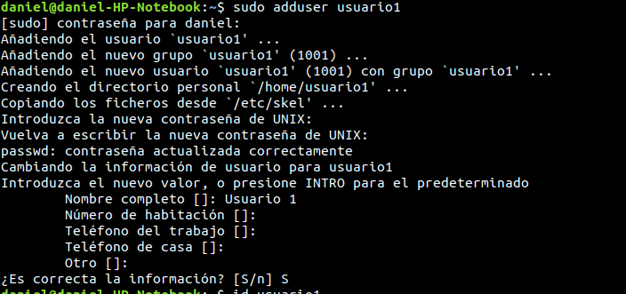
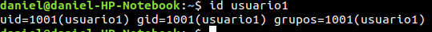
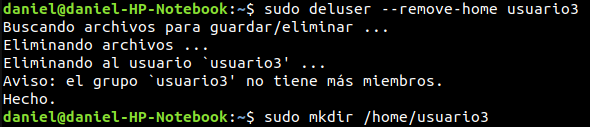
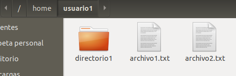
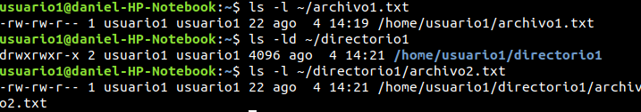
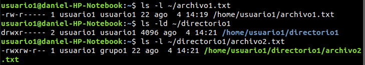

## Gestión de Usuarios

1. Creación de usuarios y contraseñas:

```bash
sudo adduser usuario1
sudo adduser usuario2
sudo adduser usuario3
```

<center></center>

2. Información de usuarios:

```bash
id usuario1
```

<center></center>

3. Eliminación de usuarios:

```bash
sudo deluser --remove-home usuario3
sudo mkdir /home/usuario3
``` 

<center></center>

## Gestión de Grupos

1. Creación de grupos:

```bash
sudo groupadd grupo1
sudo groupadd grupo2
``` 

2. Agregar usuarios a grupos:

```bash
sudo usermod -aG grupo1 usuario1
sudo usermod -aG grupo2 usuario2
``` 

3. Verificar membrecia:

```bash
groups usuario1
groups usuario2
```

<center></center>

4. Eliminar grupos:

```bash
sudo groupdel grupo2
```

## Gestión de Permisos

1. Creación de archivos y documentos:

Primero, cambiamos al usuario usuario1

```bash
su - usuario1
``` 

Luego, creamos el archivo y el directorio con el archivo dentro

```bash
echo "Contenido de archivo1" > ~/archivo1.txt
mkdir ~/directorio1
echo "Contenido de archivo2" > ~/directorio1/archivo2.txt
```

<center></center>

2. Verificar permisos:

```bash
ls -l ~/archivo1.txt
ls -ld ~/directorio1
ls -l ~/directorio1/archivo2.txt
``` 

<center></center>

3. Modificar permisos usando chmod modo numérico:

```bash
chmod 640 ~/archivo1.txt
```

4. Modificar permisos usando chmod modo simbólico:

```bash
chmod u+x ~/directorio1/archivo2.txt
```

5. Cambiar el grupo propietario:

```bash
sudo chown :grupo1 ~/directorio1/archivo2.txt
```

6. Configurar permisos de directorio:

```bash
chmod 740 ~/directorio1
```

7. Configurar permisos de directorio:

```bash
chmod 740 ~/directorio1
```

8. Comprobación de acceso:

Primero, cambiamos al usuario usuario2

```bash
su - usuario2
``` 

Luego, intentamos acceder a los archivos

```bash
cat ~usuario1/archivo1.txt
cat ~usuario1/directorio1/archivo2.txt
```

9. Verificación final:

```bash
su - usuario1
ls -l ~/archivo1.txt
ls -ld ~/directorio1
ls -l ~/directorio1/archivo2.txt
```

<center></center>
