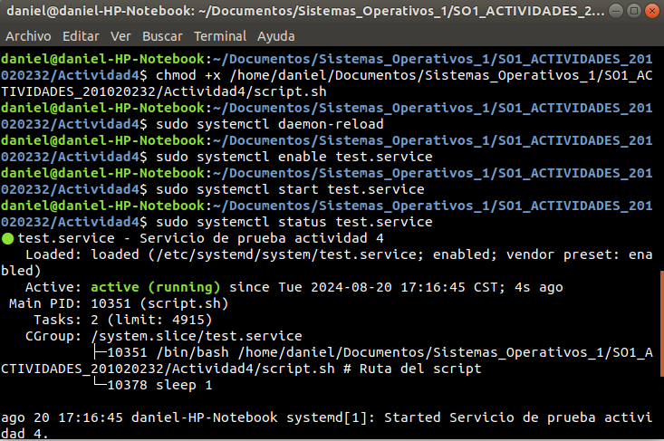
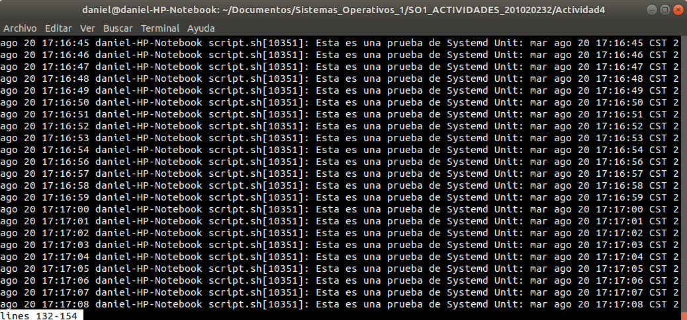
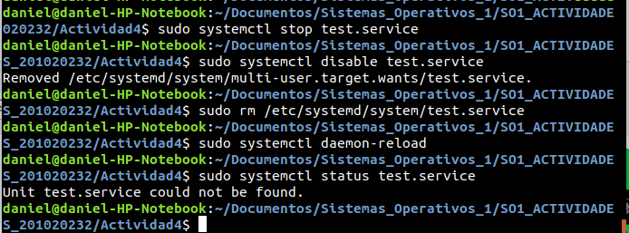

## Gestión de Usuarios

1. Crear el archivo de bash script.sh:

```bash
#!/bin/bash

while true; do
    echo "Esta es una prueba de Systemd Unit: $(date)"
    sleep 1
done
```

2. Crear el archivo de systemd unit test.service y guardarlo en /etc/systemd/system/:

```bash
[Unit]
Description=Servicio de prueba actividad 4

[Service]
Type=simple
ExecStart=/home/daniel/Documentos/Sistemas_Operativos_1/SO1_ACTIVIDADES_201020232/Actividad4/script.sh # Ruta del script
Restart=always

[Install]
WantedBy=multi-user.target
```

3. Habilitar el servicio para que se inicie con el sistema:

```bash
sudo systemctl daemon-reload
sudo systemctl enable test.service
sudo systemctl start test.service
sudo systemctl status test.service
``` 

<center></center>

4. Verificar que el servicio se esté ejecutando correctamente.:

```bash
sudo journalctl -u test.service
``` 

<center></center>

5. Eliminar el servicio:

```bash
sudo systemctl stop test.service
sudo systemctl disable test.service
sudo rm /etc/systemd/system/test.service
sudo systemctl daemon-reload
sudo systemctl status test.service
``` 

<center></center>


